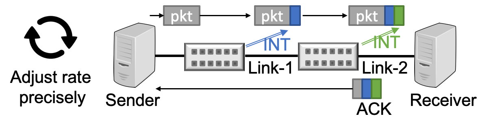

# HPCC: High Precision Congestion Control

## Overview
HPCC, a new high-speed CC mechanism, achieves ultra-low latency, high bandwidth, and network stability simultaneously. HPCC leverages in-network telemetry (INT) to obtain precise link load information and controls traffic precisely. HPCC can quickly converge to utilize free bandwidth while avoiding congestion, and can maintain near-zero in-network queues for ultra-low latency.

HPCC has been deployed in Alibaba. It shortens the flow completion times by up to 95% compared to the previous generation CC (DCQCN) for datacenters.

**[New] We have recently enhanced HPCC with PINT, a probalistic version of INT that reduces the INT overhead to ≤2 bytes without losing precision for HPCC.**

## News

* [PINT is published in SIGCOMM' 2020](https://liyuliang001.github.io/publications/pint.pdf), which enhances HPCC by removing the INT overhead without losing HPCC's precision.
* HPCC is widely reported by media globally: [Intelligent Data Centres (UK)](https://www.intelligentdatacentres.com/2019/08/28/alibaba-unveils-congestion-control-mechanism-for-ultra-high-speed-data-centres/), [Intelligent CIO (UK)](https://www.intelligentcio.com/eu/2019/08/28/alibaba-unveils-congestion-control-mechanism-for-ultra-high-speed-data-centres/), [Data Economy](https://data-economy.com/alibaba-builds-further-on-impressive-cloud-sales-growth/), [it-daily.net (Germany)](https://www.it-daily.net/shortnews/22200-staukontrollmechanismus-fuer-ultra-high-speed-rechenzentren), [Info HighTech (France)](https://www.infohightech.com/alibaba-devoile-un-nouveau-mecanisme-de-controle-de-la-congestion-pour-les-datacenters-hautes-performances/), [Channel Business Partners (France)](https://www.channelbp.com/content/alibaba-d%C3%A9voile-un-nouveau-m%C3%A9canisme-de-contr%C3%B4le-de-la-congestion-pour-les-datacenters-haute), [Le Mag IT](https://www.lemagit.fr/actualites/252469976/Des-chercheurs-dAlibaba-accelerent-de-95-les-reseaux-Ethernet), [IT Numeric](http://www.itnumeric.com/alibaba-devoile-un-nouveau-mecanisme-de-controle-de-la-congestion-pour-les-datacenters-hautes-performances/), [Global Security Mag](http://www.globalsecuritymag.fr/Alibaba-devoile-un-nouveau,20190829,90257.html), [M2M Mag](http://www.mtom-mag.com/article8895.html), [Intrusio](http://www.intrusio.fr/non-classe/alibaba-devoile-un-nouveau-mecanisme-de-controle-de-la-congestion-pour-les-datacenters-hautes-performances/), [Animasoft](https://animasoft.com/articles/180956/avec-le-mecanisme-hpcc-alibaba-cloud-compte-ameliorer-la-transmission-des-donnees-entre-data-centers.html), [ITR News](https://itrnews.com/articles/180956/avec-le-mecanisme-hpcc-alibaba-cloud-compte-ameliorer-la-transmission-des-donnees-entre-data-centers.html), [IT Channel](https://itchannel.info/articles/180956/avec-le-mecanisme-hpcc-alibaba-cloud-compte-ameliorer-la-transmission-des-donnees-entre-data-centers.html), [La Vie Numérique](https://lavienumerique.com/articles/180956/avec-le-mecanisme-hpcc-alibaba-cloud-compte-ameliorer-la-transmission-des-donnees-entre-data-centers.html), [ITR Innovation](https://itrinnovation.com/articles/180956/avec-le-mecanisme-hpcc-alibaba-cloud-compte-ameliorer-la-transmission-des-donnees-entre-data-centers.html), [ITR Manager](https://itrmanager.com/articles/180956/avec-le-mecanisme-hpcc-alibaba-cloud-compte-ameliorer-la-transmission-des-donnees-entre-data-centers.html), [ITR Software](https://itrsoftware.com/articles/180956/avec-le-mecanisme-hpcc-alibaba-cloud-compte-ameliorer-la-transmission-des-donnees-entre-data-centers.html), [Tendances IT](https://tendancesit.com/articles/180956/avec-le-mecanisme-hpcc-alibaba-cloud-compte-ameliorer-la-transmission-des-donnees-entre-data-centers.html), [ITR Mobiles](https://itrmobiles.com/articles/180956/avec-le-mecanisme-hpcc-alibaba-cloud-compte-ameliorer-la-transmission-des-donnees-entre-data-centers.html), [ITR Games](https://itrgames.com/articles/180956/avec-le-mecanisme-hpcc-alibaba-cloud-compte-ameliorer-la-transmission-des-donnees-entre-data-centers.html), [IPE Newsmag](https://ipe-newsmag.com/articles/180956/avec-le-mecanisme-hpcc-alibaba-cloud-compte-ameliorer-la-transmission-des-donnees-entre-data-centers.html), [Electronique-Newsmag](https://electronique-newsmag.com/articles/180956/avec-le-mecanisme-hpcc-alibaba-cloud-compte-ameliorer-la-transmission-des-donnees-entre-data-centers.html), [l'Entreprise connectée](https://lentrepriseconnectee.com/articles/180956/avec-le-mecanisme-hpcc-alibaba-cloud-compte-ameliorer-la-transmission-des-donnees-entre-data-centers.html), [Info DSI](https://infodsi.com/articles/180956/avec-le-mecanisme-hpcc-alibaba-cloud-compte-ameliorer-la-transmission-des-donnees-entre-data-centers.html)
* [HPCC is published in SIGCOMM' 2019](https://liyuliang001.github.io/publications/hpcc.pdf). Please watch our [conference talk video](https://dlnext.acm.org/doi/abs/10.1145/3341302.3342085).

## Publications
* [PINT: Probabilistic In-band Network Telemetry](https://liyuliang001.github.io/publications/pint.pdf)  
Ran Ben Basat, Sivaramakrishnan Ramanathan, Yuliang Li, Gianni Antichi, Minlan Yu, Michael Mitzenmacher  
ACM SIGCOMM, 2020
* [HPCC: High Precision Congestion Control](https://liyuliang001.github.io/publications/hpcc.pdf)  
Yuliang Li, Rui Miao, Hongqiang Liu, Yan Zhuang, Fei Feng, Lingbo Tang, Zheng Cao, Ming Zhang, Frank Kelly, Mohammad Alizadeh, Minlan Yu  
ACM SIGCOMM, 2019

## Key results
We post [latest results](results.md) with both INT-based and PINT-based HPCC.
We evaluate HPCC comprehensively under different application workload (web search and hadoop) and different network load (30%, 50%, 70%). 

## Code
* [NS3 simulation](https://github.com/alibaba-edu/High-Precision-Congestion-Control)
