# HPCC: High Precision Congestion Control

## Overview
HPCC, a new high-speed CC mechanism, achieves ultra-low latency, high bandwidth, and network stability simultaneously. HPCC leverages in-network telemetry (INT) to obtain precise link load information and controls traffic precisely. HPCC can quickly converge to utilize free bandwidth while avoiding congestion, and can maintain near-zero in-network queues for ultra-low latency.

HPCC has been deployed in Alibaba. It shortens the flow completion times by up to 95% compared to the previous generation CC (DCQCN) for datacenters.

**[New] We have recently enhanced HPCC with PINT, a probalistic version of INT that reduces the INT overhead to ≤2 bytes without losing precision for HPCC.**

## News

* [PINT is published in SIGCOMM' 2020](https://liyuliang001.github.io/publications/pint.pdf), which enhances HPCC by removing the INT overhead without losing HPCC's precision.
* HPCC is widely reported by media globally: Intelligent Data Centres (UK), Intelligent CIO (UK), Data Economy, it-daily.net (Germany), Info HighTech(France), Channel Business Partners (France), Le Mag IT, IT Numeric, Global Security Mag, M2M Mag Intrusio Animasoft, ITR News, IT Channel, La Vie Numérique, ITR Innovation, ITR Manager, ITR Software, Tendances IT, ITR Mobiles, ITR Games, IPE Newsmag, Electronique-Newsmag, l'Entreprise connectée, Info DSI
* [HPCC is published in SIGCOMM' 2019](https://liyuliang001.github.io/publications/hpcc.pdf). Please watch our [conference talk video](https://dlnext.acm.org/doi/abs/10.1145/3341302.3342085).

## Publications
* [PINT: Probabilistic In-band Network Telemetry](https://liyuliang001.github.io/publications/pint.pdf)  
Ran Ben Basat, Sivaramakrishnan Ramanathan, Yuliang Li, Gianni Antichi, Minlan Yu, Michael Mitzenmacher  
ACM SIGCOMM, 2020
* [HPCC: High Precision Congestion Control](https://liyuliang001.github.io/publications/hpcc.pdf)  
Yuliang Li, Rui Miao, Hongqiang Liu, Yan Zhuang, Fei Feng, Lingbo Tang, Zheng Cao, Ming Zhang, Frank Kelly, Mohammad Alizadeh, Minlan Yu  
ACM SIGCOMM, 2019

## Key results
We have done comprehensive evaluations in both hardware testbeds and in simulations, under different application workload, at different network load. In our SIGCOMM' 2019 paper, we only show the most important results due to the space limit. Here we show the complete results that we have.

### Settings
We run in [ns3 simulation](https://github.com/alibaba-edu/High-Precision-Congestion-Control), with the same topology and configurations of CC schemes as those in the paper. In the paper, we already show that DCQCN+w and TIMELY+w is much better than DCQCN and TIMELY, so here we only compare with their +w versions. For HPCC, here we run at η=99%; in our paper we evaluate η=95% because other proposals typically use 95% [[RCP](http://yuba.stanford.edu/~nanditad/thesis-NanditaD.pdf),[HULL](https://www.usenix.org/system/files/conference/nsdi12/nsdi12-final187.pdf)], but now we find that η=99% does not introduce any problems and improves link utilization, which is important at high network load. Besides, HPCC's maxStage=0, which is the same as the simulation setting in our paper. The maxStage=5 in the paper is due to a typo for the simulation.

In addition, we also evaluation HPCC-PINT, which **uses PINT to reduce the INT overhead to fewer than 2 bytes per packet**. We call the original version as HPCC-INT. While HPCC-INT have to tolerate the extra header overhead (~5%), **HPCC-PINT evaluates the real power of HPCC's algorithm** with negligible extra header overhead.

*Network load* definition: The network load we evaluate (30%, 50%, 70%) are defined as the ratio between the number of total application bytes (payload) per second to the bandwidth. So the actual load to the network is ~11% higher (each data packet has 50-byte header (HPCC has more due to the INT header) and 60-byte ACK, so for 1 KB paylaod, 110 bytes are 11% more). Other papers may have different definitions.

*Flow completion time (FCT)* definition: a flow's FCT is defined as the time period from when the flow is created to when the last byte is acknowledged at the sender.

*Slowdown* definition: a flow's slowdown is calcualted as the actual FCT normalized by it ideal FCT when the network only has this flow and the packets only have basic headers (i.e., no INT header).

### Under normal network load (30%)
We first evaluate under the normal network load, which is around 30% [[Microsoft](https://conferences.sigcomm.org/sigcomm/2017/files/program-kbnets/keynote-2.pdf), [Facebook](https://conferences.sigcomm.org/sigcomm/2015/pdf/papers/p123.pdf)].

#### Web search workload
|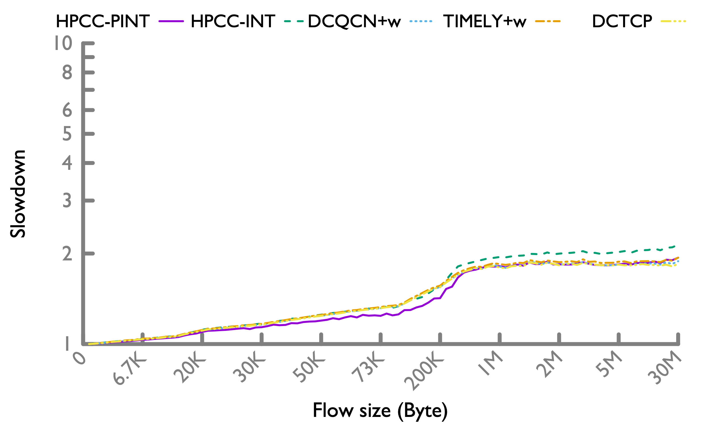 50-th percentile|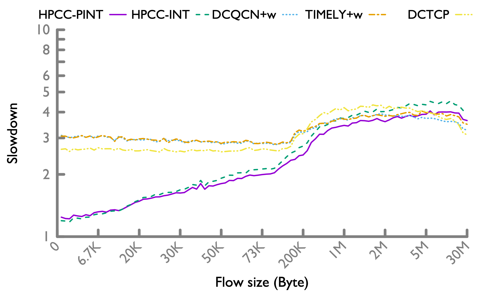 95-th percentile|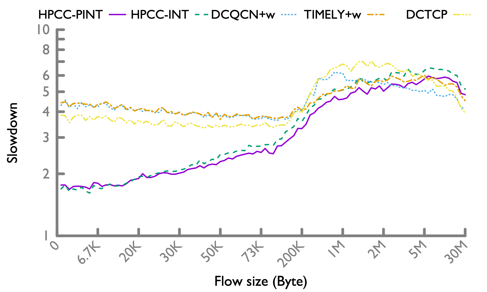 99-th percentile|
|---|---|---|

HPCC significantly improves the FCT for flows < 200KB, especially at the tail. This is because HPCC resolves congestion in just one RTT, and converge to zero queue thereafter. HPCC-INT has longer FCT for long flows, which is expected because of the INT overhead, which means HPCC-INT effectively runs at a higher network load (~5% more) than other CC schemes. HPCC-PINT almost remove this extra overhead, so it improves the long flows' FCT over HPCC-INT, and makes them comparable to other schemes that keeps the buffer highly occupied. This effect is explained in detail in [PINT paper](https://liyuliang001.github.io/publications/pint.pdf).

#### Hadoop workload
|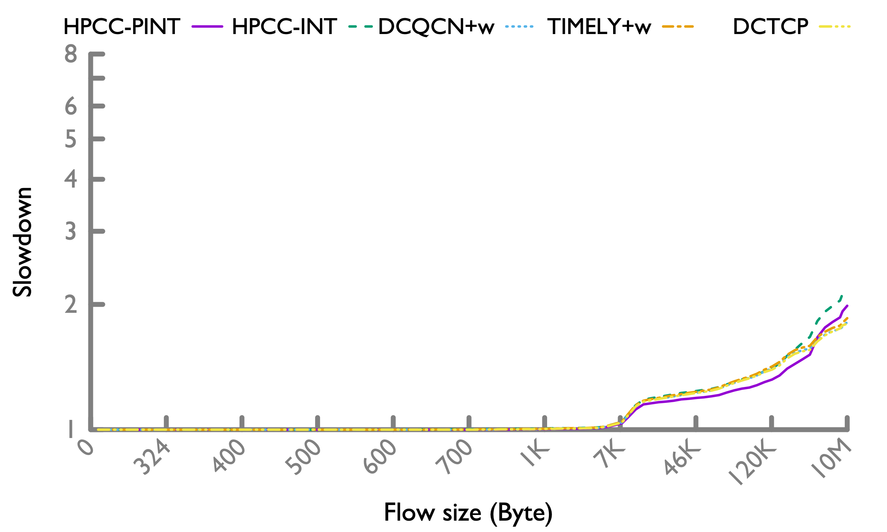 50-th percentile|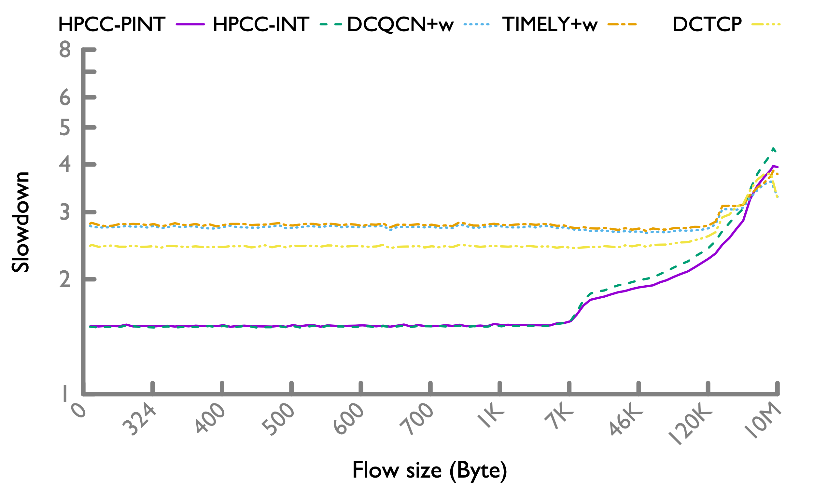 95-th percentile|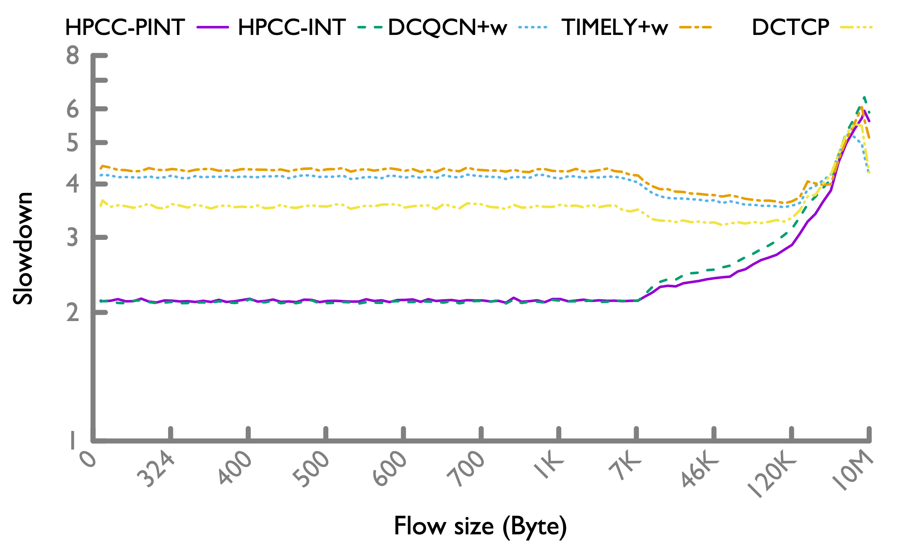 99-th percentile|
|---|---|---|

Under the Hadoop workload, the trend is similar. Moreover, since there are more short flows, HPCC's advantage is more evident.

### Under high network load (50%)
It is possible that the network load sometime exceeds the normal condition. So it is also worth evaluating 50% load to represent the occasional high load.

#### Web search workload
|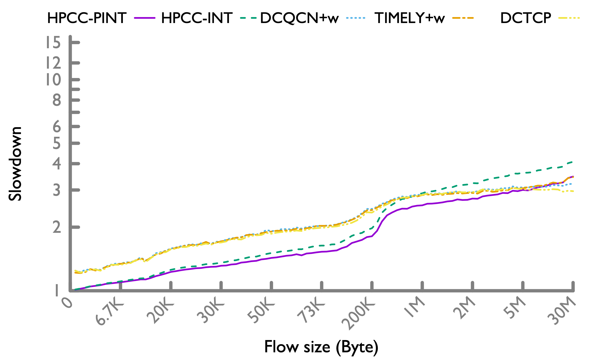 50-th percentile|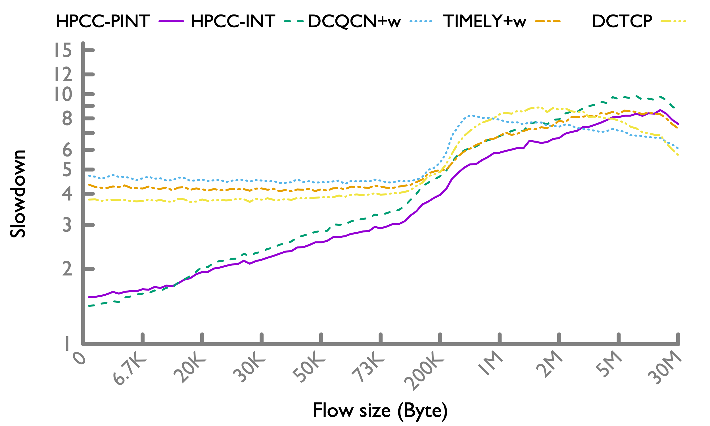 95-th percentile|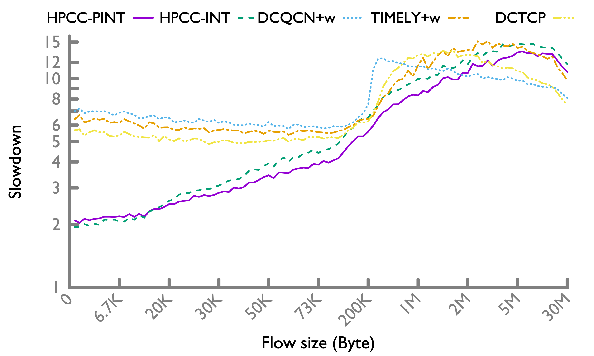 99-th percentile|
|---|---|---|

The trend is similar to the 30% load case. But it is important to note that under 50% load, HPCC improves the short flows FCT even at 50-th percentile (unlike the 30% load case where 50-th percentile FCT are similar across different schemes).

#### Hadoop workload
|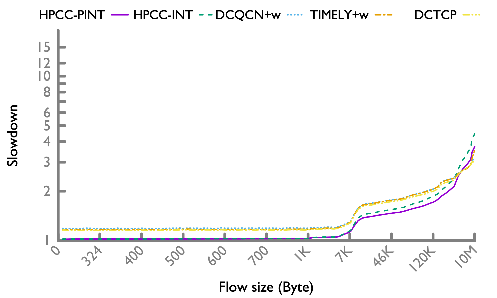 50-th percentile|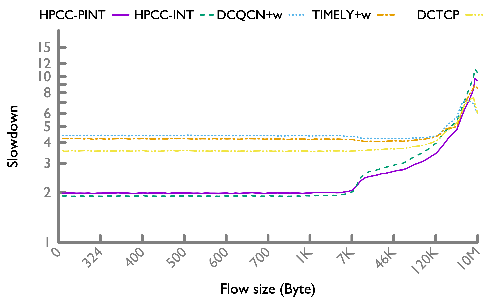 95-th percentile|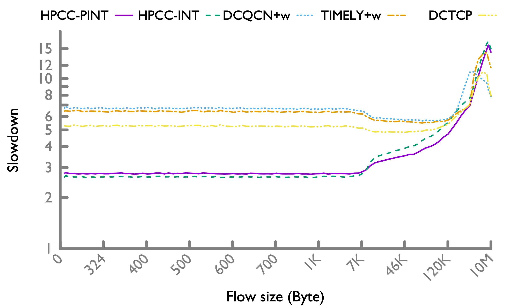 99-th percentile|
|---|---|---|

The trend is similar to the web search workload.

### Stress testing (70%)
A network load higher than 50% can make the network brittle--link or switch failures can cause severe congestion or even ever-increasing number of unfinished flows [[CONGA](https://people.csail.mit.edu/alizadeh/papers/conga-sigcomm14.pdf)]. This is because ECMP balances traffic poorly under asymmetry. Failrues are so common in datacenters that the topology is typically guaranteed to be asymmetric [[Google](http://www.sysnet.ucsd.edu/sysnet/miscpapers/wcmp-eurosys-final.pdf)].

That said, it is still interesting to see how HPCC performs in this region of extremely high load as stress testing. There are also recent papers focus on this region. So we evaluate HPCC under 70% network load. Note that our 70% only considers the payload, so the actual load to the network is >77.7%.

#### Web search workload
|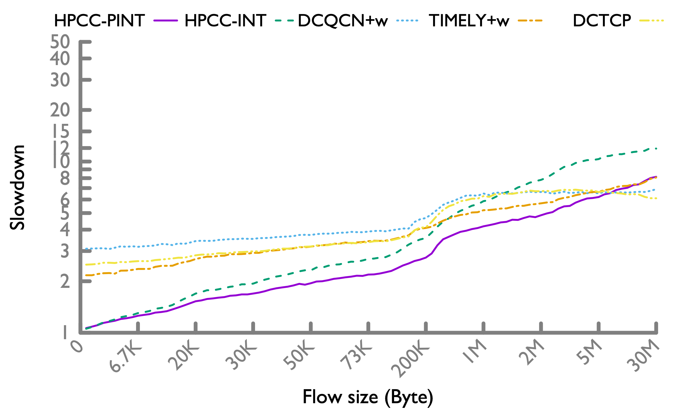 50-th percentile|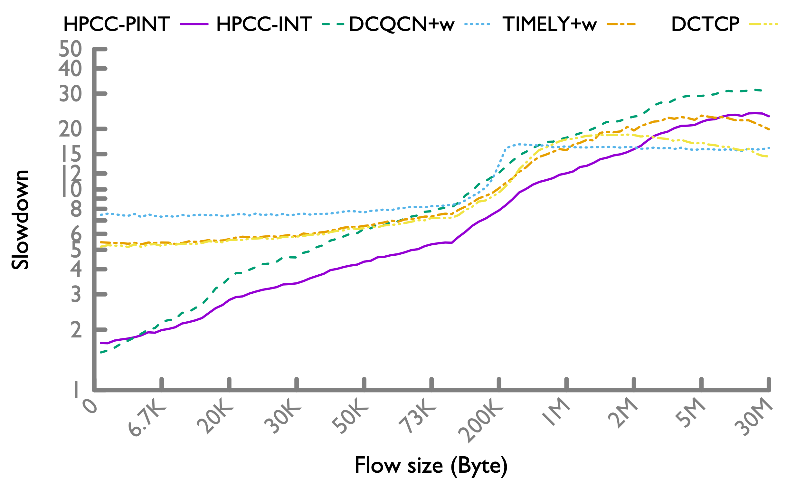 95-th percentile|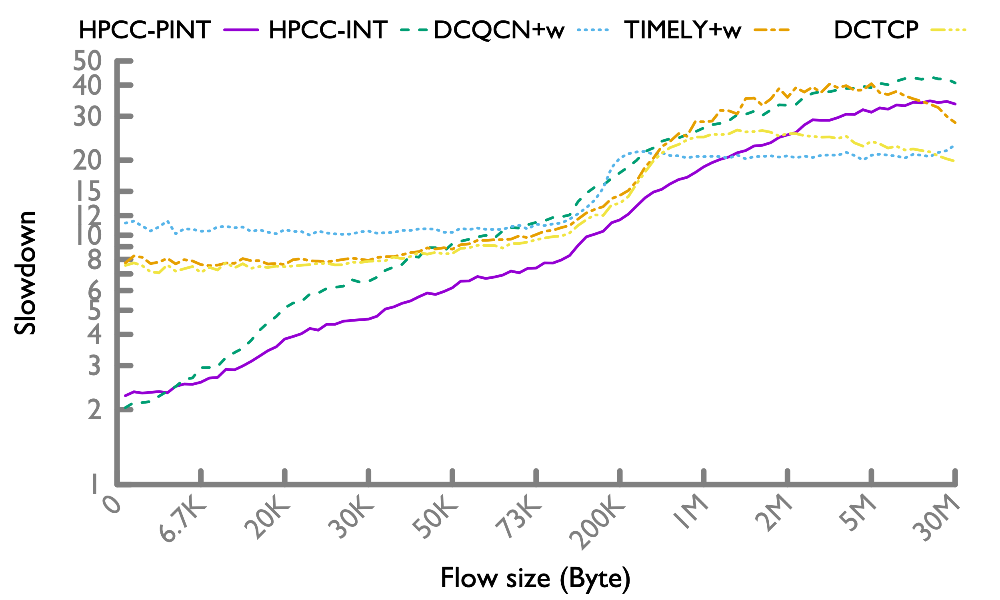 99-th percentile|
|---|---|---|

As the network load increases, the gap of short flow FCT between HPCC and other schemes are larger (note the y axis range). At 50-th percentile, HPCC is slightly slower for very long flows (>6MB) than other schemes; and the gap is larger at tail. HPCC's longer FCT for long flows is expected because HPCC keeps the queue zero. As a result, when a flow finishes, the bandwidth may be under-utilized for an RTT (till other flows grab the free bandwidth). At a higher load, flows come and finish more frequently, thus the under-utilization also happens more frequently. Other CC schemes keep the switch buffer highly utilized, so even if a flow finishes, there are still enough packets in the queue to keep the bandwidth fully utilized. So this is a fundamental tradeoff of choosing zero queue in favor of short flows.

#### Hadoop workload
| 50-th percentile| 95-th percentile|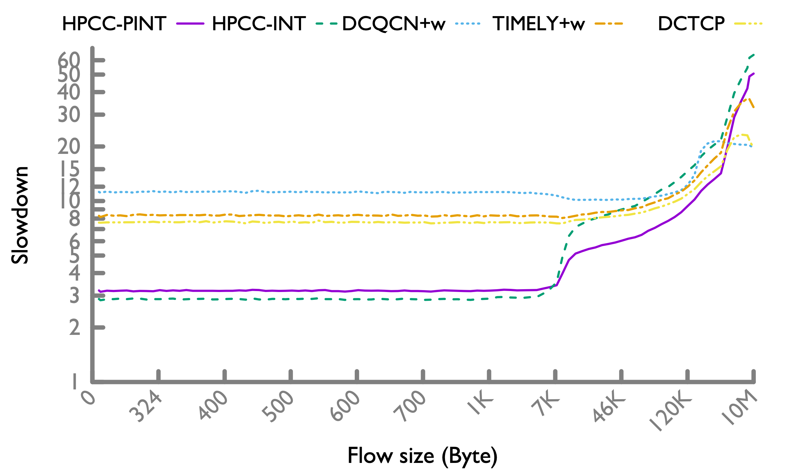 99-th percentile|
|---|---|---|

In Hadoop workload, there are more short flows, so HPCC's advantage more significantly overweighs the slowdown of long flows.

